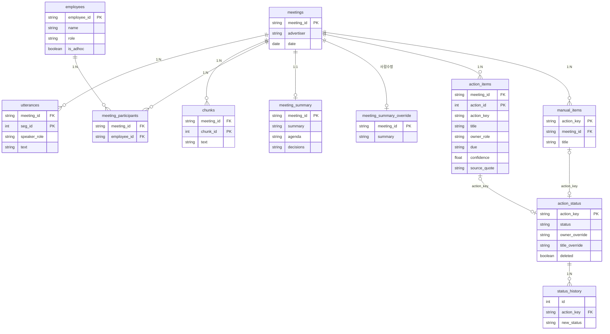

# 회의록 자동 정리·액션아이템 추출 시스템 — 기획안

모비데이즈 AI Tech Lab 사전과제 · 황수진

> 코드가 본체이므로 이 문서는 **의사결정 근거**만 압축한다.
> 핵심 난제: *신뢰할 수 없는 LLM 출력을 신뢰할 수 있는 데이터로 바꾸기.*

---

## 1. 문제 재정의

- **상황**: 광고주별 주간 캠페인 회의 → 회의 후 담당자가 회의록 정리 + 액션아이템을 트래킹 도구로 이관.
- **페인포인트**
    - 정리 부담: 회의당 30~60분 소요.
    - 액션아이템 누락: 한국어 회의 특유의 화법 탓. "일단 두고 봐요"(흐릿한 결정), "그건 제가 챙길게요"(암묵적 R&R).
- **설계 무게중심 = 믿을 수 있는 추출**
    - 어려운 건 시간이 아니라 품질. 시간 절감은 자동화로 쉽게 따라오지만, 흐릿한 한국어 회의에서 “무엇이 액션이고 누가 책임자인가”를 정확히 뽑는 게 진짜 난제.
    - 접근: 흐릿한·암묵적 항목도 버리지 않고 낮은 confidence로 추출(누락↓), 단순 의견은 제외하고 근거 없는 인용은 떼어내 신뢰도를 낮춤, 불확실한 항목은 사람이 검수해 최종 판단(human-in-the-loop).
    - 놓친 액션은 일정 지연·광고주 신뢰 하락으로 직결 → 품질이 곧 임팩트.

---

## 2. 시스템 아키텍처

```
[수집]              [처리·저장]            [AI 추출/정리]            [분배]        [분석]
음성(mp3)─Whisper STT─┐               ┌─ 액션아이템(검증·재시도·환각필터·conf) ─┬─ Slack 페이로드
                     ├ 정제·청크·DuckDB ┤                                      │
transcript JSON ─────┘ (화자정규화·약어) └─ 회의록(요약·안건·결정)               ├─ Streamlit 대시보드
                                          [LLM: mock/Gemini/Ollama]            │  · 회의록 목록→상세
                                       action_status ◄──────────────────────┘  · 위젯 + 상태 편집
                                       (사람이 관리, 재실행에도 보존)
```

**핵심 설계 결정**

- **LLM provider 추상화**: mock·Gemini·Ollama를 인터페이스 하나로 토글. 외부 유출 금지 제약은 온프레미스 Ollama로 충족.
- **신뢰성은 한 점이 아니라 흐름 전체로**: 파싱 → 검증 → 보정/재시도 → 환각 필터 (→ 5번 참고).
- **화자 구분은 단계적 보완**: 음성 diarization도 `SPEAKER_00`까지만 줌 → 비용 0인 "명단 기반 LLM 매핑 + 사람 보정"을 먼저 구현, 음성 diarization은 향후 확장.

**단계별 선택과 trade-off**

| 단계 | 선택 | 근거 |
|---|---|---|
| STT | 로컬 Whisper | 외부 유출 금지 → 클라우드 STT 불가. 비용 0·온프레미스 |
| 저장소 | DuckDB | 임베디드 OLAP, 집계 쿼리에 강함. 100명 PoC에 Postgres는 과함 |
| LLM | mock / Gemini / Ollama | Gemini=무료 JSON, Ollama=온프레미스(유출 충족), mock=결정적 시연 |
| 검증 | pydantic | 출력을 타입·필수값·범위로 강제 → 적재 전 차단 |
| 대시보드 | Streamlit | 파이썬 단일 스택, DuckDB 직접 연결, 빠른 PoC |
| 키워드 | BoW + kiwipiepy 명사추출 | 한국어 명사만 추출(kiwipiepy, 미설치 시 정규식 폴백) 후 tf·df 가중. PoC엔 설명 가능, 누적 시 임베딩 |

---

## 3. 데이터 스키마 설계

DuckDB · 11개 테이블 (ERD, 주요 컬럼)



**테이블별 역할·설계 메모**

| 테이블 | 역할 | 설계 메모 |
|---|---|---|
| `meetings` | 회의 메타(광고주·날짜) | 정규화. 광고주명은 여기 한 곳에만 |
| `utterances` | 화자분리 발화 원문 | 원문 보존(추적성), 정제는 청크 단계에서만 |
| `chunks` | LLM 입력 단위 | 의미 단위로 분할 |
| `employees` | 직원 마스터(id·이름·역할) | 정규화. 직원 정보는 여기만, `is_adhoc`로 STT 미상 화자 구분 |
| `meeting_participants` | 회의↔직원 연결 | FK만 저장(다대다) → 갱신 이상 방지 |
| `meeting_summary` | 회의록(요약·안건·결정) | 재실행마다 갱신. agenda/decisions는 JSON 배열 |
| `meeting_summary_override` | 사람이 수정한 회의록 | 파이프라인 미접근 → 재실행에도 보존 |
| `action_items` | AI 추출 결과 | 회의 단위 멱등 교체. `source_quote`·`source_seg_ids` 비정규화로 함께 저장 → 조인 없이 근거 추적 |
| `action_status` | 진행상황(사람 소유) | 추출과 분리, 재실행 보존. override로 담당자·제목·기한 수정 보존 |
| `manual_items` | 사람이 추가한 액션아이템 | 추출과 별개라 재실행 보존 |
| `status_history` | 상태 변경 이력 | 감사 추적 |

**추출 / 트래킹 레이어 분리 (가장 중요한 결정)**

- 문제: LLM은 재실행 시 제목을 미세하게 다르게 냄.
- 해결: `action_items`(AI)는 회의 단위로 통째 교체(delete-replace, 멱등). 사람이 바꾼 진행상황은 `action_status`에 따로 두고 파이프라인이 안 건드림. 둘은 `action_key`(meeting_id + 정규화 제목 해시)로 연결.
- 효과: "AI 추출은 멱등 재생성 + 사람 수정은 생존"이 동시에 성립. (status가 `action_items`가 아니라 `action_status`에 있는 이유)
- 한계: `meeting_id`가 입력 id 의존, 제목 해시라 LLM 재서술 시 키 어긋남 → 복합키·임베딩 매칭으로 보완(6번).

**액션아이템 필드 근거**

- `owner_role`: 불명확하면 `null` (억지 배정 금지).
- `due`: "다음주 금요일" 등 자연어 보존.
- `confidence`(0~1): 낮은 항목만 사람이 검수하는 운영 기준.
- `source_seg_ids`·`source_quote`: 환각 방지·근거 추적.

---

## 4. Before / After 임팩트 추정 (사내 100명 기준)

- **측정된 값(PoC, 실측)**: 추출 **F1 0.81 · Recall 0.81(= 누락 약 19%) · 담당자 0.77** (수기 21건 gold, `make eval`).
  타입 보정 전 F1 0.67 → 보정 후 0.81로 개선 효과를 수치로 확인.
- 아래 표는 위 실측치 + 가정(광고주 약 30곳 × 주 1회 ≈ 주 30건, 회의당 정리 30~60분)에 기반한 **보수적 추정**이며, 실데이터로 검증해야 한다.

| 지표 | 현재 | 기대(추정) | 근거 |
|---|---|---|---|
| 회의당 정리 시간 | 30~60분 | 절반 이하로 단축(추정) | 자동 초안 생성 + 낮은 confidence 항목만 검수 |
| 액션 누락 | PoC 약 19%(1−Recall) | 검수 루프로 추가 회수 | `make eval` 측정값 |
| 우선 검수량 | 전건(100%) | 낮은 confidence만 (PoC 21건 중 3건 ≈ 14%) | confidence < 0.6 우선 검수 |

- 핵심은 절대값이 아니라 **"검수를 일부 항목으로 좁히면서 누락을 잡는 구조"**다. 시간·채택률 등은 도입 후 실측으로 보정(6번).

---

## 5. 실패 시나리오와 대응

- **① LLM 환각·스키마 위반**
    - 위험: 없는 액션 생성, 잘못된 JSON, 입력에 없는 발화 인용.
    - 대응: pydantic 강제 → 위반 시 강화 프롬프트 재시도 / 인용 id가 입력에 없으면 제거 + confidence 하향 / 재시도 소진 시 빈 결과 + 로그(파이프라인 생존).
- **② STT 오인식**
    - 위험: 받아쓰기 자체 오류("GA→GAS", "이중 집계→이중 집게" 등 실측, `docs/STT_품질검증.md`). STT가 전체 품질의 상한.
    - 대응: 고성능 STT를 토대로 + 약어 사전·LLM 화자 매핑·사람 검수로 완충.
- **③ 외부 API 장애·quota 초과**
    - 위험: Gemini 429/장애로 추출 중단.
    - 대응: 429 백오프 + provider 추상화로 Ollama/mock 전환. 멱등 설계라 재실행해도 중복 없음. 실서비스는 사내 LLM으로 유출 금지까지 동시 충족(PoC에서 Ollama로 검증).

---

## 6. 성공 지표(KPI)와 검증 계획

도입 후 "효과가 있는가, 믿고 쓸 수 있는가"를 숫자로 검증한다.

| KPI | 목표 | 현재(PoC) | 측정 |
|---|---|---|---|
| 추출 정확도(F1) | ≥ 0.8 | **0.81** | gold(수기) 대비 `make eval` |
| 누락률(1−Recall) | ≤ 5% | 약 19% | 1주차 수기 vs AI 병행 비교 |
| 정리 시간 | 절반 이하 | — | 담당자 타임로그 |
| 채택률(AI 초안 사용) | ≥ 70% | — | 상태 편집·수정 로그(`status_history`) |
| confidence 신뢰성 | 0.9+ 구간 정확도 ≥ 0.9 | — | 검수 결과 × confidence calibration |

- **모니터링**: LLM 실패율(스키마 위반·429), confidence 분포 추이(하락 시 STT 품질 저하 신호), 사람 수정 빈도(잦으면 프롬프트 튜닝 트리거).
- **4주 운영**: ①주 소수 팀 병행으로 기준선(P/R) → ②주 약어·프롬프트 튜닝 + 확대 → ③주 전사 + 모니터링 상시 → ④주 KPI 종합 후 확대/롤백 결정.

---

## 7. 구현 현황 · 향후 확장 (참고)

- **구현한 가산점**: 회의록 자동 정리 · 실제 LLM 호출(Gemini·Ollama) · 로컬 Whisper STT + 화자 매핑 · 직원 마스터 정규화 · 진행상황 업데이트 루프 · 추출 품질 eval · Slack 페이로드.
- **향후 확장**
    - 회의 식별을 (광고주+날짜+시간) 복합키로 → 멱등성 사람 손 없이 보장 *(우선순위 높음)*
    - 제목 임베딩 매칭으로 LLM 재서술에도 사람 수정 유지
    - 기한 자연어 → 절대 날짜 정규화 → 마감 임박순 정렬·알림
    - 음성 diarization 추가, Slack/노션 양방향 연동
